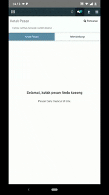

# Mail Mobile

This module create native notification to android and ios with react-native, what's you need just change source url to your odoo site.

# Step to use

## Install Module

This step just like reguler step to install odoo module

- Copy folder mail_mobile to your odoo addons folder
- Install module

## Generate App

I'm using react native in this project because i need create an android and ios app, and i don't have in swift experience. So i create it with react native, that's all.

- Open file App.js
- Search `source: "https://your_odoo_url.com"`
- Change to your odoo site

# Dependencies

1. [React Native](wow)
2. [React Native Webview](https://github.com/react-native-community/react-native-webview)
3. [React Native Push Notification](https://github.com/zo0r/react-native-push-notification)
